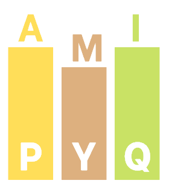

# 📚 amiPYQ – Your Ultimate College PYQ Archive for Amity University

Welcome to **Amipyq**, the go-to platform for Amity University students to easily access 
and contribute previous year question papers (PYQs) from 2014 to the present. Designed with 
simplicity and community spirit, Amipyq helps every student prepare effectively and excel in their exams.

---

## ✨ Features

- 📂 Organized collection of PYQs for all Amity University courses, from 2014 to present
- 🌓 User-friendly dark mode toggle for comfortable reading  
- 🙌 Community-driven: contribute your PYQs and get recognized on the Contributors page  
- 🔍 Simple and intuitive interface to quickly find the papers you need  
- 📱 Fully responsive design optimized for desktops, tablets, and mobiles  
- 🎨 Clean, modern UI for a smooth browsing experience

---

