

  

[🌐 Visit Website](https://amipyq.com/)

# 📚 AmiPYQ – Your Ultimate College PYQ Archive for Amity University

Welcome to **AmiPYQ**, the go-to platform for Amity University students to easily access 
and contribute previous year question papers (PYQs) from 2014 to the present. Designed with 
simplicity and community spirit, Amipyq helps every student prepare effectively and excel in their exams.

---

## ✨ Features

- 📂 Organized collection of PYQs for all Amity University courses, from 2014 to present
- 🌓 User-friendly dark mode toggle for comfortable reading  
- 🙌 Community-driven: contribute your PYQs and get recognized on the Contributors page  
- 🔍 Simple and intuitive interface to quickly find the papers you need  
- 📱 Fully responsive design optimized for desktops, tablets, and mobiles  
- 🎨 Clean, modern UI for a smooth browsing experience

---
## 🖼️ Project Snapshots

### 📱 Home Page
| Dark Mode | Light Mode |
|-----------|------------|
| 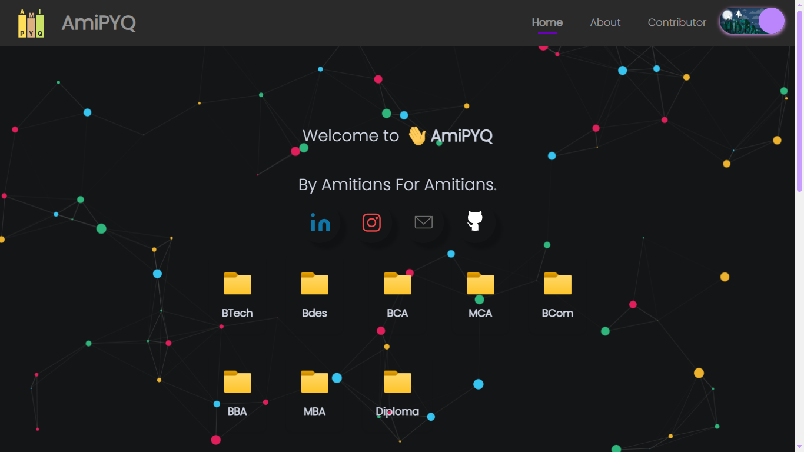 | 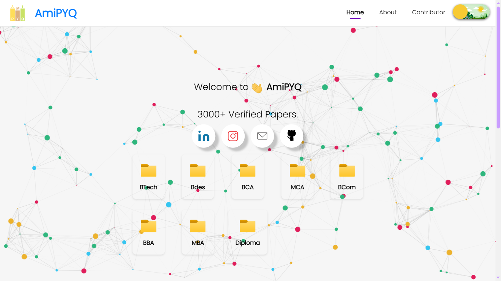 |

### 🎓 B.Tech Page

| Dark Mode | Light Mode |
|-----------|------------|
| 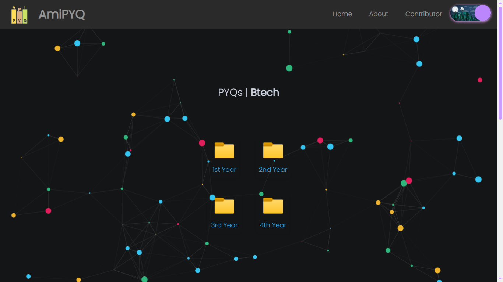 | 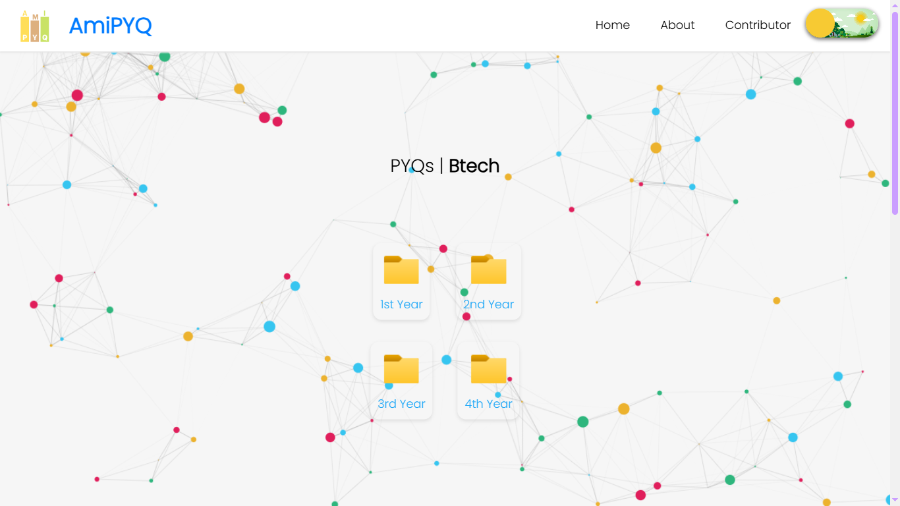 |

### 📘 Diploma 1st Year Page

| Dark Mode | Light Mode |
|-----------|------------|
| 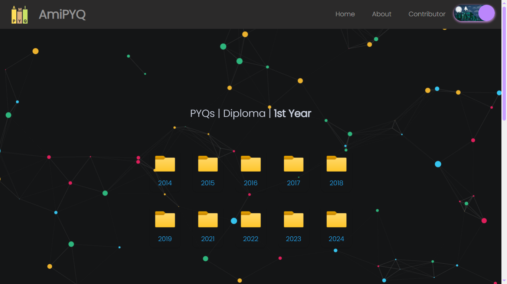 | 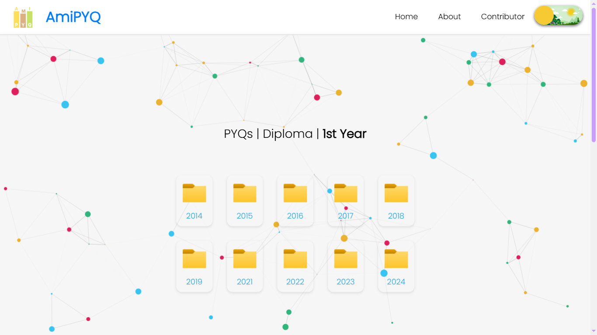 |

### 📂 PYQ Page

| Dark Mode | Light Mode |
|-----------|------------|
| 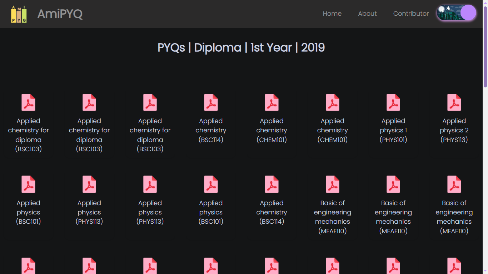 | 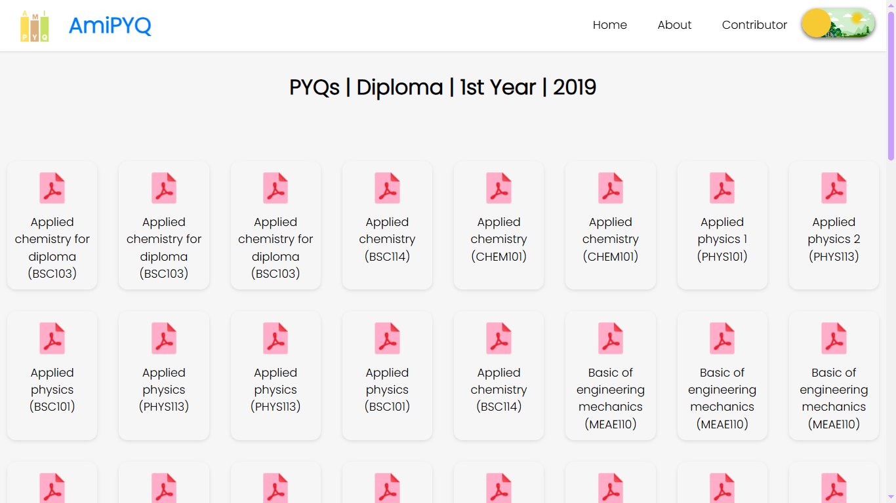 |

### ℹ️ About Page

| Dark Mode | Light Mode |
|-----------|------------|
|  | 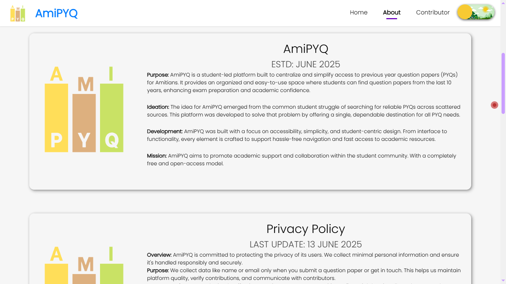 |

### 🤝 Contributor Page

| Dark Mode | Light Mode |
|-----------|------------|
| 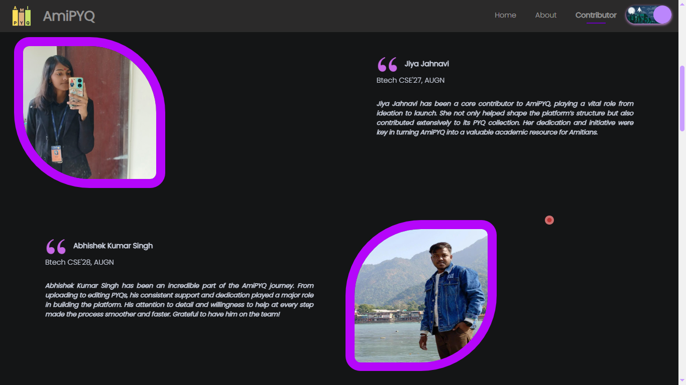 | 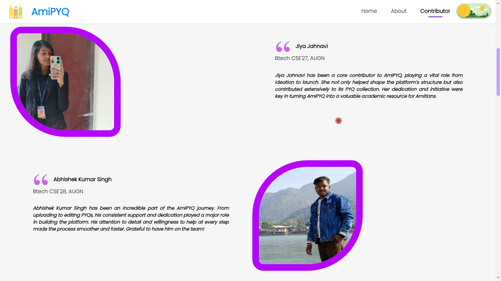 |

### 🤝 Testimonial Page

| Dark Mode | Light Mode |
|-----------|------------|
| 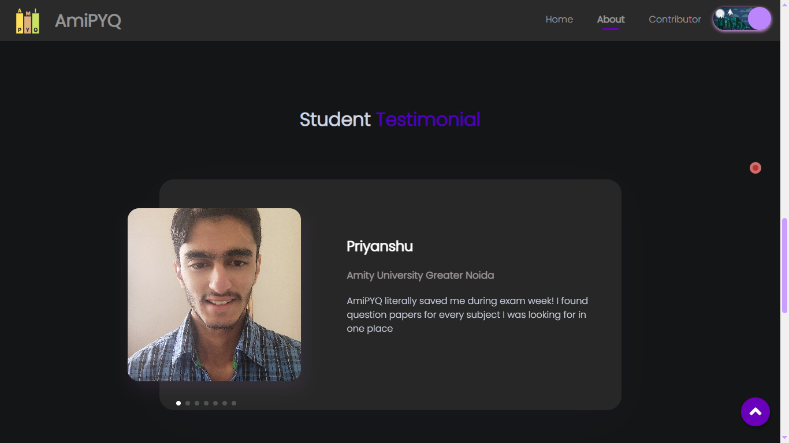 | 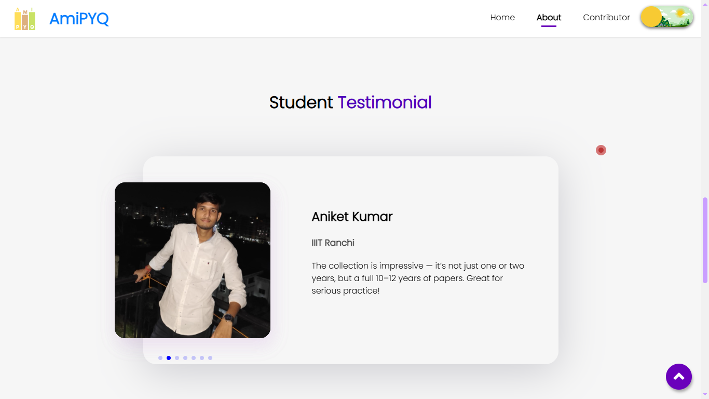 |

| Contact Page | How to Contribute |
|-----------|------------|
| 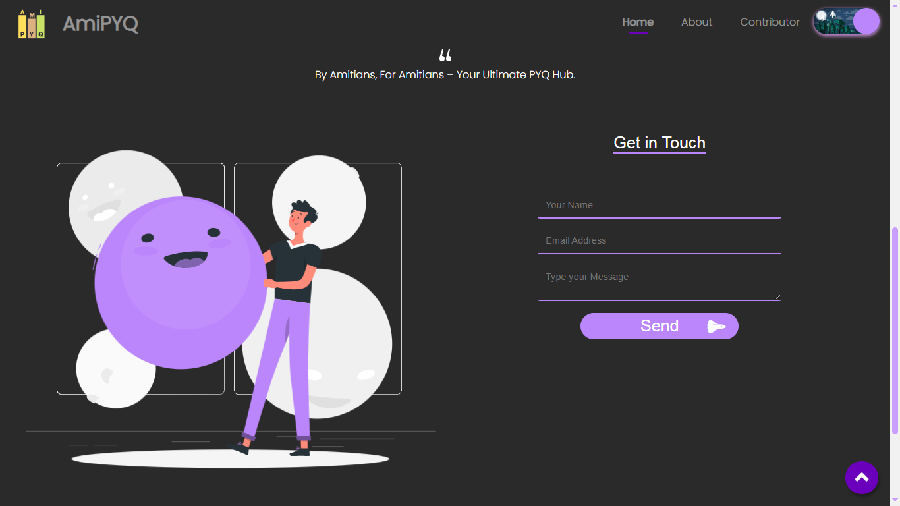 | 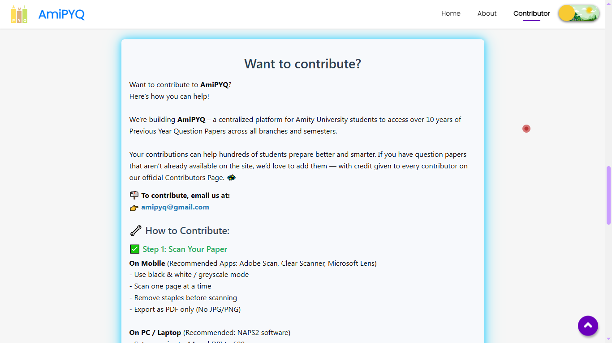 |

---

## 📱 Contact

-🌐 Website: [amipyq.com](https://amipyq.com/)

-📩 If you’d like to contribute, share PYQs, or collaborate — feel free to email at amipyq@gmail.com
